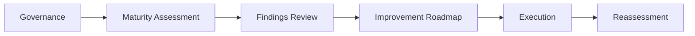

# Framework Overview

## What This Framework Does

The Enterprise Resilience Maturity Model helps organizations understand how well their cloud and digital operating model supports governance, resilience, recovery, and continuous improvement.
It gives teams a shared way to score maturity and plan what to improve next.
The framework is also intended to make the resilience story easy to show from the parent MCGR page and related ecosystem pages.

## Resilience Flow

## What It Covers

- governance ownership and decision rights
- reliability engineering and service ownership
- disaster recovery planning and testing
- observability and signal quality
- FinOps and cost accountability
- architecture governance
- executive reporting and improvement planning

## Who Uses It

- enterprise architects
- cloud governance leaders
- reliability and SRE teams
- disaster recovery and continuity planners
- finance and FinOps teams
- executive sponsors

## What Good Looks Like

- leaders can see the current maturity state quickly
- each finding is supported by evidence
- each domain has an owner and an improvement path
- the roadmap can be revisited and measured over time
- the lowest-scoring domain is obvious

## How To Read It

Start with the framework overview, then move into the scoring model and domain pages.
That sequence keeps the discussion focused on what is being measured before getting into how it gets improved.

## Result

The framework helps teams compare resilience maturity across domains and turn findings into an actionable roadmap.

## Practical Use

Use this framework when you need one model that can summarize resilience maturity across governance, reliability, DR, observability, and FinOps.

## Outputs

- maturity scorecards
- executive resilience summary
- improvement roadmap
- domain-specific findings
- recurring re-assessment plan

## Resilience Layers

| Layer | Question | Artifact |
| --- | --- | --- |
| Governance | Who owns the program? | Governance model |
| Assessment | How mature are we? | Scorecard |
| Improvement | What needs to change? | Improvement plan |
| Reporting | What should leaders see? | Executive report |
| Reassessment | Did it improve? | Reassessment schedule |
